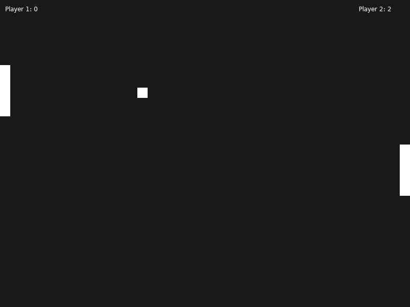

# Tennis Game

"Tennis Game" is a local multiplayer game built using the Love2D framework. The game features a classic tennis-style gameplay with a single player versus AI mode. Players control paddles to hit a ball back and forth, aiming to score points by making the ball pass their opponent's paddle.

## Controls

- **W**: Move Player 1's paddle up.
- **S**: Move Player 1's paddle down.
- **P**: Pause or resume the game.
- **Enter**: Start the game from the title screen.
- **Space**: Restart the game after a game over.
  
## How to run

- make sure you have everything installed for running a lua file with Löve2D
- download the code from this repo
- open the main.lua file in vscode
- press alt + l and the game starts running

